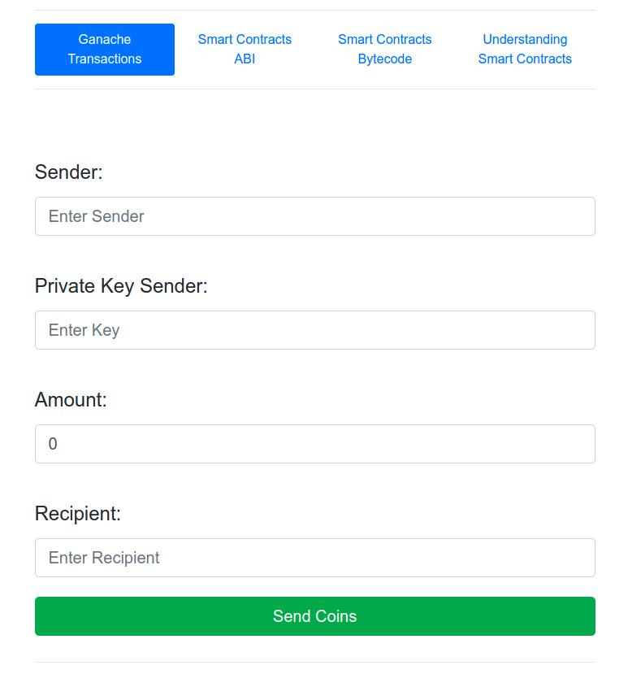
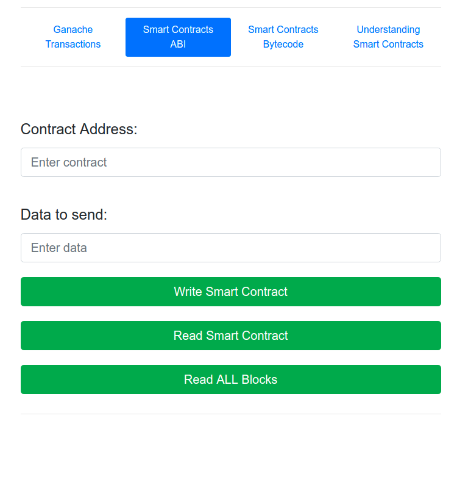
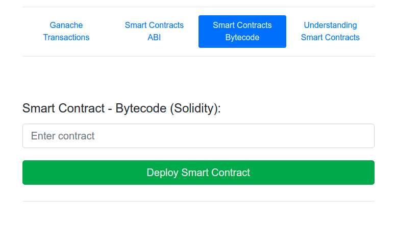

# Python + Ethereum tester

## Prerequisites

The following are the tools used in the project:

- Ganache 2.1.0
- Python 3
- Flask 
- Bootstrap
- vue.js
- axios

Make sure Ganache is running on your machine. 

Ganache installation click [here](https://www.trufflesuite.com/ganache)

## Screenshots

### Screenshot 1

### Screenshot 2

### Screenshot 3

